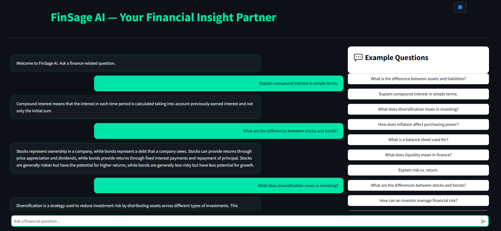

**FinSage AI** is an educational web application that explains financial and economic concepts through a Retrieval-Augmented Generation (RAG) architecture powered by **Google Gemini 2.0 Flash**.  
It combines FAISS-based vector retrieval and Gemini’s generation capabilities to produce context-grounded financial explanations using the **Finance-Alpaca** dataset.

---

## Overview
FinSage AI implements a complete RAG pipeline:
- Loads and indexes the *Finance-Alpaca* dataset from Hugging Face  
- Generates embeddings with `BAAI/bge-small-en-v1.5`  
- Stores and retrieves vectors via **FAISS**  
- Synthesizes educational responses using **Gemini 2.0 Flash**  
- Presents results through a modern **Streamlit** chat interface  

---

## Live Demo
https://finsageai.streamlit.app  

<p align="center">
  
</p>

---

## Dataset
Uses the **Finance-Alpaca** dataset (`gbharti/finance-alpaca`) —  
a curated, instruction-based dataset for finance and economics.  
No live financial data is accessed or stored.

---

## Features
- Context-aware educational Q&A  
- FAISS-based semantic retrieval  
- Transparent context display  
- Local caching for speed  
- Minimal, responsive dark theme UI  

**Ideal for**
- Finance & economics students  
- Educators and content creators  
- Researchers exploring RAG systems  

---

## Technologies Used
**Backend**     Python 3.10+  
**Frontend**   Streamlit  
**LLM**        Google Gemini 2.0 Flash  
**Embeddings** SentenceTransformers (`BAAI/bge-small-en-v1.5`)  
**Vector DB**  FAISS  
**Dataset**    Finance-Alpaca (Hugging Face)  

---

## Local Installation

```bash
git clone https://github.com/nuricanaksu/finance-rag-chatbot.git
cd finance-rag-chatbot
bash

python -m venv .venv
.venv\Scripts\activate      # Windows
# source .venv/bin/activate # Mac/Linux
bash
 
pip install -r requirements.txt
create a .env file and add your key:

bash

GOOGLE_API_KEY=your_api_key_here
run the app:

bash

streamlit run app.py
then open
http://localhost:8501

Project Structure
bash
Kodu kopyala
finance-rag-chatbot/
├── app.py
├── requirements.txt
├── .env
├── data/
│   ├── passages.jsonl
│   └── faiss.index
├── finsage.png
└── README.md

Security
For local use:

ini

GOOGLE_API_KEY=your_api_key_here
For Streamlit Cloud:

toml

GOOGLE_API_KEY = "your_api_key_here"
.env and data/ are already excluded in .gitignore.

License
MIT License — open for learning and adaptation.